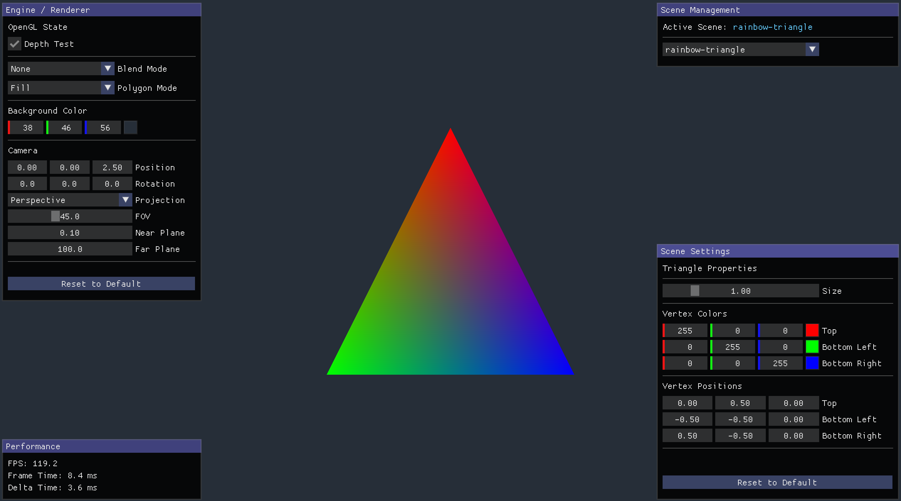
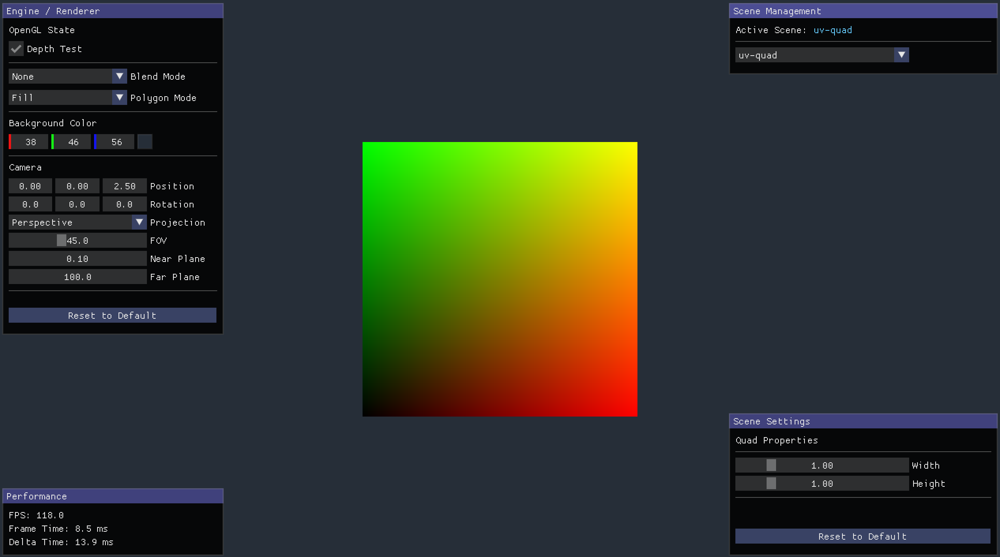
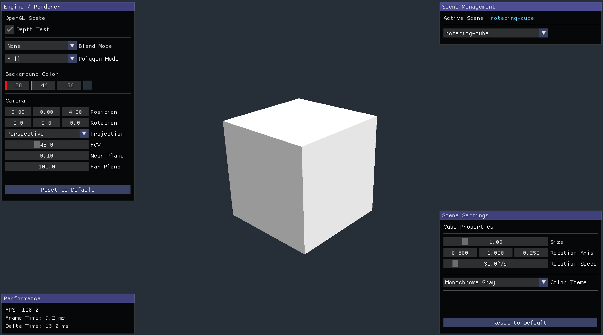
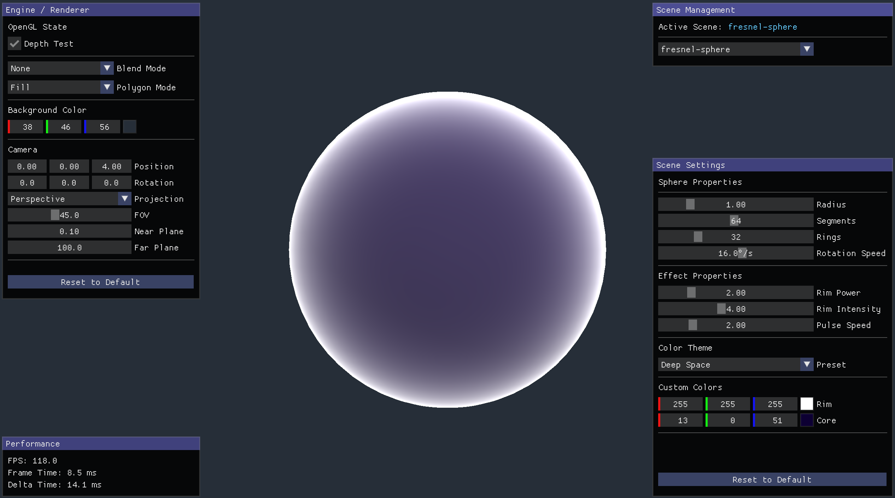
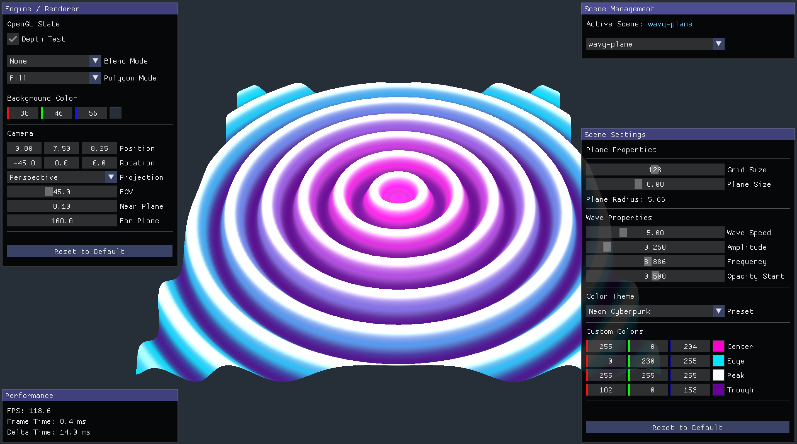

# Shaders In Computer Graphics

This repository, developed by [Davit Badalyan](https://github.com/davit-badalyan), contains a practical rendering application and research materials for a master's thesis on **Shaders In Computer Graphics**.

## Table of Contents

- [About](#about)
- [Preview](#preview)
- [Getting Started](#getting-started)
- [Useful Links](#useful-links)
- [License](#license)

##  About

The purpose of this project is to research Shaders and Computer Graphics by building a Practical Rendering Application that demonstrates their capabilities and use cases. The application allows users to create, manipulate, and experiment with Shaders, showcasing what can be achieved with them and how they function in a Real-Time Rendering Environment.

At its core, this project is a Minimal Rendering Application designed to serve as an experimental environment where Example Scenes can be easily created, Shaders can be tested and iterated on, and various Computer Graphics Techniques can be explored. The primary goal is to provide a Hands-On Learning Experience for understanding Shader Programming and fundamental Computer Graphics Concepts.

Beyond research and learning, the project is built with Extensibility and Modularity in mind, serving as a foundation that can later be developed into a more substantial system, such as a Game Engine or a more comprehensive Graphics Framework.

##  Preview

### Showcases

<video src="https://github.com/user-attachments/assets/c5a35089-b3fb-49a7-849a-cc465bb54783" controls width="100%" alt="Cube Showcase">
  Your browser does not support the video tag.
</video>

---

### Screenshots

#### Rainbow Triangle

---

#### UV Quad

---

#### Rotating Cube

---

#### Fresnel Sphere

---

#### Wavy Plane

##  Getting Started

### Prerequisites

**Note:** Prerequisites will be listed here once the build process is stabilized across all platforms.

### Building and Running

**Note:** This application was built and tested on macOS. There are known issues with the Windows and Linux building and running process. This section will be updated with detailed instructions for all platforms.

**Development System Specifications:**

- macOS 26.2 (25C56)
- Apple M1 Pro
- 16 GB RAM

**Build Tools:**

- CMake 4.1.2 (minimum 3.10 required)
- Apple Clang 17.0.0 (C++17 compiler)

**Graphics API:**

- OpenGL 3.3+

**Dependencies & Libraries:**

- **GLFW** - Window Creation and Input Management
- **GLM** - OpenGL Mathematics Library
- **GLAD** - OpenGL Function Loader
- **ImGui** - Immediate mode GUI Framework

##  Useful Links

Here is a list of references, books, tutorials, and online courses that were used during the development and helped throughout the process:

**Note:** This section will be updated with detailed resources and references.

### Learning Materials

- ...

### Interactive Tools & Platforms

- ...

### Documentations and Technical References

- ...

##  License

This repository is licensed under the [MIT License](https://opensource.org/license/mit/).

If you have any questions, encounter issues, or wish to share suggestions, please open an issue.

Happy coding!
